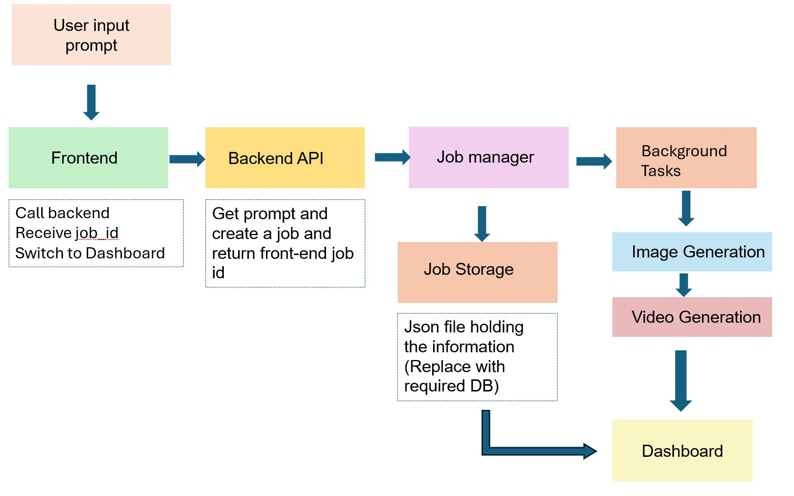

# Ad Generator Frontend

A React-based frontend for an AI-powered advertisement generation application.

## Features

- 🎬 Modern, responsive UI with gradient design
- 📝 User-friendly text input interface
- 🖼️ Display generated logos
- 🎥 Display generated advertisement videos
- 📥 Download functionality for both logo and video
- 🔄 Regenerate and edit capabilities
- 📱 Mobile-responsive design
- ⚡ Built with Vite for fast development

## Setup Instructions

1. Install dependencies:
   ```bash
   cd frontend
   npm install
   ```

2. Start the development server:
   ```bash
   npm run dev
   ```

3. Open your browser to `http://localhost:3000`

## Fallback Files

Currently, the app uses fallback files:
- `/output.png` - placeholder for generated logos
- `/output.mp4` - placeholder for generated videos

To test with actual files, place `output.png` and `output.mp4` in the `frontend/public/` directory.

## Future Integration

When the backend is ready, you can connect it by:

1. Updating the `handleGenerate` function in `src/App.jsx`
2. Uncommenting the API fetch code
3. Adding your backend API endpoint

## Tech Stack

- React 18
- Vite
- CSS3 (Custom properties)
- Responsive Design

- Modern JavaScript (ES6+)

## Data Flow Diagram


